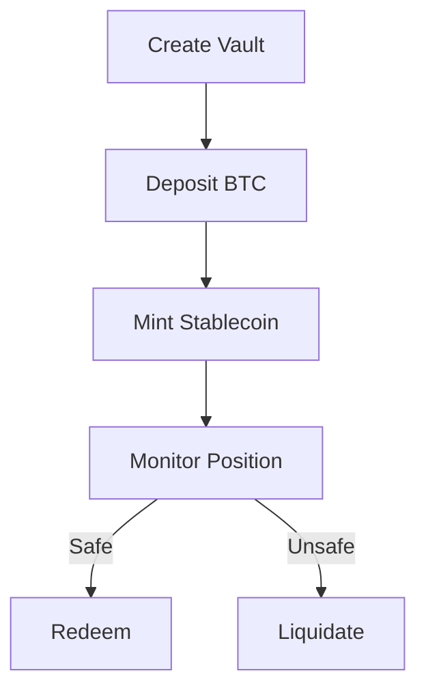

# BitVault Protocol - Technical Documentation

## Table of Contents

1. [Introduction](#introduction)
2. [Key Features](#key-features)
3. [Technical Specifications](#technical-specifications)
4. [Contract Architecture](#contract-architecture)
5. [Core Functions](#core-functions)
6. [Error Codes](#error-codes)
7. [Security Considerations](#security-considerations)
8. [Usage Examples](#usage-examples)
9. [Testing & Auditing](#testing--auditing)
10. [Disclaimer](#disclaimer)

## Introduction <a name="introduction"></a>

BitVault is a decentralized finance protocol enabling the creation of algorithmic stablecoins collateralized by Bitcoin on the Stacks Layer 2 network. Combining Bitcoin's security with Stacks' programmability, BitVault implements a non-custodial system for capital-efficient BTC utilization through:

- Over-collateralized debt positions (150% minimum ratio)
- Decentralized price feeds
- Automated liquidation mechanisms
- Protocol-governed parameters

## Key Features <a name="key-features"></a>

### 1. Bitcoin-Backed Collateralization

- 150% minimum collateral ratio (adjustable via governance)
- Real-time collateral health monitoring
- Stacks L2-native BTC representation

### 2. Decentralized Oracle System

- Multi-feeder price aggregation
- Time-stamped BTC/USD pricing
- Authorized oracle management

### 3. Risk Management

- 125% liquidation threshold
- Public liquidation incentives
- Collateral surplus protection

### 4. Protocol Governance

- Adjustable collateral parameters
- Owner-controlled oracle management
- System parameter safeguards

## Technical Specifications <a name="technical-specifications"></a>

### Contract Traits

```clarity
(define-trait sip-010-trait [...])
```

### System Constants

| Constant             | Value     | Description                  |
| -------------------- | --------- | ---------------------------- |
| `ERR-NOT-AUTHORIZED` | u1000     | Authorization failure        |
| `MAX-BTC-PRICE`      | 1e12      | Maximum BTC price (sats/USD) |
| `CONTRACT-OWNER`     | tx-sender | Deployer address             |

### Data Storage

```clarity
;; Protocol State
(define-data-var total-supply uint u0)
(define-data-var collateralization-ratio uint u150)

;; Oracle System
(define-map btc-price-oracles principal bool)

;; Vault Registry
(define-map vaults {...} {...})
```

## Contract Architecture <a name="contract-architecture"></a>

### 1. Oracle Management

- Authorized price feeders
- Time-bound price updates
- Price validation safeguards

### 2. Vault System



### 3. Risk Parameters

| Parameter             | Default | Range    | Governance |
| --------------------- | ------- | -------- | ---------- |
| Collateral Ratio      | 150%    | 100-300% | Owner      |
| Liquidation Threshold | 125%    | Fixed    | -          |
| Mint Fee              | 0.5%    | Fixed    | -          |

## Core Functions <a name="core-functions"></a>

### 1. Oracle Management

```clarity
(define-public (add-btc-price-oracle (oracle principal))
(define-public (update-btc-price (price uint) (timestamp uint))
```

### 2. Vault Operations

```clarity
(define-public (create-vault (collateral-amount uint))
(define-public (mint-stablecoin ...))
(define-public (redeem-stablecoin ...))
```

### 3. Risk Management

```clarity
(define-public (liquidate-vault ...)
```

### 4. Governance

```clarity
(define-public (update-collateralization-ratio ...)
```

## Error Codes <a name="error-codes"></a>

| Code  | Description               | Resolution                    |
| ----- | ------------------------- | ----------------------------- |
| u1000 | Unauthorized access       | Verify caller privileges      |
| u1002 | Invalid collateral amount | Ensure amount > 0             |
| u1003 | Undercollateralized       | Add collateral or reduce debt |
| u1005 | Liquidation failed        | Position still safe           |

## Security Considerations <a name="security-considerations"></a>

### 1. Collateral Safeguards

- Minimum 150% over-collateralization
- Independent price feeds
- Maximum price sanity checks

### 2. System Protections

```clarity
(asserts! (<= price MAX-BTC-PRICE) ...)
(asserts! (<= timestamp MAX-TIMESTAMP) ...)
```

### 3. Access Controls

- Owner-restricted oracle management
- Vault-specific authorization
- Governance parameter boundaries

## Usage Examples <a name="usage-examples"></a>

### 1. Creating a Vault

```clarity
(contract-call? .bitvault create-vault u100000000)
```

### 2. Minting Stablecoins

```clarity
(contract-call? .bitvault mint-stablecoin 'SZ2J6ZY48GV1EZ5V2V5RB9MP66SW86PYKKQ9H6DPR u1 u50000)
```

### 3. Liquidating a Vault

```clarity
(contract-call? .bitvault liquidate-vault 'SZ2J6ZY48GV1EZ5V2V5RB9MP66SW86PYKKQ9H6DPR u1)
```

[](https://docs.stacks.co/write-smart-contracts/clarity-language) [](https://github.com/stacksgov/sips/blob/main/sips/sip-010/sip-010-fungible-token-standard.md)
